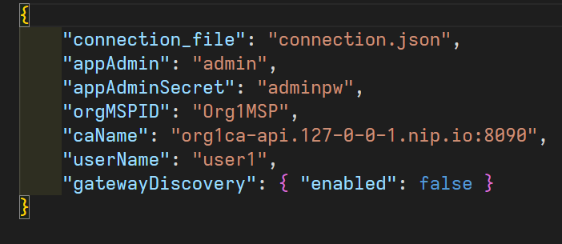

# Instalação

Os passos a seguir partem do pressuposto de que o smart-contract ja tenha seu deploy realizado no Environment.

1 - Abra a extensão da IBM;

2 - Em Fabric Environments, conecte-se ao environment que esteja usando;

3 - Em Fabric Gateways, exporte o connection profile clicando com o botão direito em Org1 Gateway > Export Connection Profile

4 - Defina o nome do arquivo como 'connection.json' e salve dentro da pasta API (substituindo o atual)

5 - Na pasta API, edite o arquivo 'config.json', alterando o item atual de 'caName' para o contido dentro de 'connection.json' > "certificateAuthorities".

ex: "org1ca-api.127-0-0-1.nip.io:8090"

